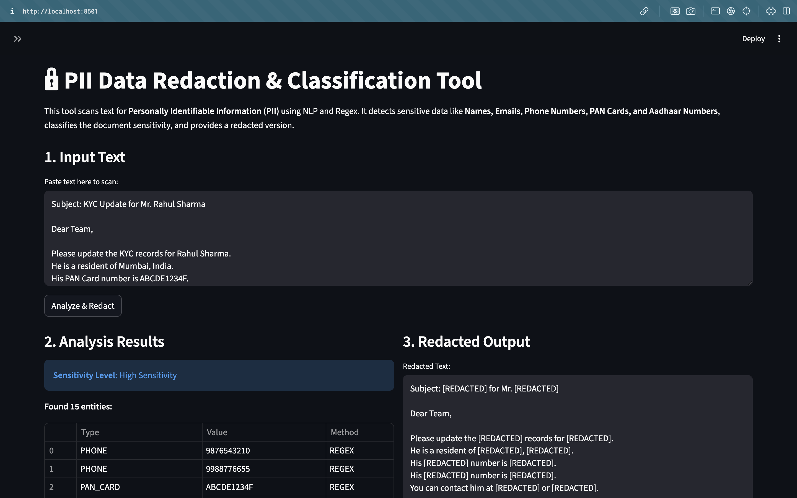
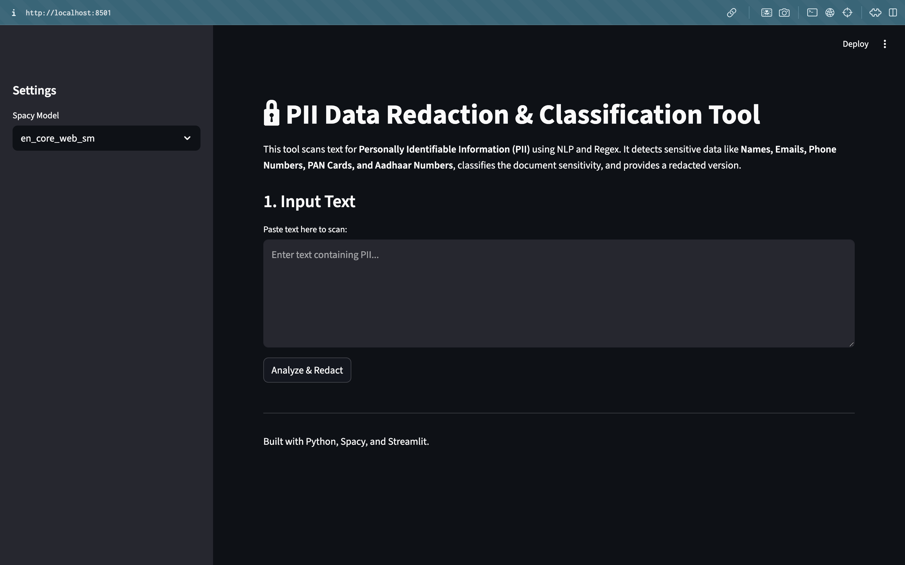

# PII Redaction & Classification Tool 🔒


## Overview

The **PII Redaction & Classification Tool** is a robust privacy utility designed to automatically scan unstructured text files, detect sensitive **Personally Identifiable Information (PII)**, classify the document's sensitivity level, and produce a sanitized (redacted) output.

It leverages a hybrid approach:
-   **Regex (Regular Expressions)**: For precise detection of structured data like Emails, Phone Numbers, PAN Cards, and Aadhaar Numbers.
-   **NLP (Spacy)**: For context-aware entity recognition of Person Names and Organizations.

## Features

-   **Multi-Method Detection**: Combines Rule-based (Regex) and AI-based (NLP) logic.
-   **Indian Context Support**: Specifically tuned to detect Indian PII:
    -   PAN Cards (e.g., `ABCDE1234F`)
    -   Aadhaar Numbers (e.g., `1234 5678 9012`)
    -   Indian Mobile Numbers (e.g., `+91 9876543219`)
-   **Smart Redaction**: Masks sensitive entities with `[REDACTED]` placeholders to prevent data leakage.
-   **Sensitivity Classification**: Automatically categorizes documents as `High`, `Medium`, or `Low` sensitivity based on the type of data found.
-   **Web Interface**: User-friendly Streamlit dashboard for easy interaction and testing.

## Demo
###Main App Interface

<br>
###Redaction Example


## Installation

1.  **Clone the Repository**
    ```bash
    git clone https://github.com/yourusername/pii-redaction-tool.git
    cd pii-redaction-tool
    ```

2.  **Install Dependencies**
    ```bash
    pip install -r requirements.txt
    ```

3.  **Download Spacy Model**
    ```bash
    python -m spacy download en_core_web_sm
    ```

## Usage

### 1. Web Interface (Recommended)
Run the Streamlit app to interact with the tool visually:
```bash
streamlit run app.py
```
This will open the tool in your browser at `http://localhost:8501`.

### 2. Command Line Interface (CLI)
You can also run the tool directly on a text file:
```bash
# General sample
python main.py data/sample.txt

# Indian context sample
python main.py data/sample_india.txt
```
The redacted file will be saved as `data/sample.txt.redacted.txt`.

## Project Structure

```
├── app.py                 # Streamlit Web Application
├── main.py                # CLI Entry Point
├── src/
│   ├── detector.py        # Core PII Detection Logic (Regex + Spacy)
│   ├── redactor.py        # Redaction Module
│   └── classifier.py      # Sensitivity Classification Logic
├── data/
│   ├── sample.txt         # General Sample Data
│   └── sample_india.txt   # Indian Sample Data
└── requirements.txt       # Project Dependencies
```

## Technologies Used

-   **Python**: Core programming language.
-   **Spacy**: Advanced Natural Language Processing.
-   **Streamlit**: Rapid web application development.
-   **Regular Expressions**: Pattern matching for structured data.

## License

This project is licensed under the MIT License.
